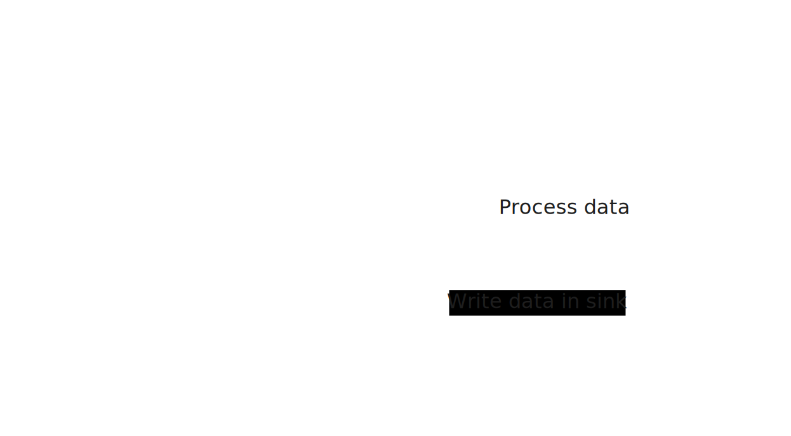

# Integration Connector Agent

The Integration Connector Agent connects to external sources and keeps changes
synchronized between the source and one or more sinks. It also allows for data
processing before sending it to the sinks.

## Key Features

- **Connect to External Sources**: Monitor and retrieve changes from various external data sources.
- **Update Sinks**: Propagate detected changes to one or more sinks to keep data up-to-date.
- **Data Processing**: Configure processors to transform or process data before sending it to the sinks.

## Architecture

Ideal for synchronizing data between different platforms or systems, ensuring
real-time updates across all configured sinks.

The following image shows the architecture of the Integration Connector Agent.



### Use Cases

Here will be described some use cases with the related configuration file.

#### Integration with Jira with MongoDB Sink

The following configuration file shows how to integrate Jira with the MongoDB sink, performing a mapper processing.

The pipeline workflow:

1. the Jira source is configured with an authentication secret taken from the environment variable `JIRA_SECRET`;
1. The input Jira issue event will be mapped to the output event:
   - `key` will be the issue.key field of the Jira event;
   - `summary` will be the issue.fields.summary field of the Jira event;
   - `createdAt` will be the issue.fields.created field of the Jira event;
   - `description` will be the issue.fields.description field of the Jira event;
1. The MongoDB sink is configured with the URL taken from the environment variable `MONGO_URL`
to save data into the collection `jira-issues`.

<details>
<summary>Jira + MongoDB Sink Configuration</summary>

```json
{
  "integrations": [
    {
      "source": {
        "type": "jira",
        "authentication": {
          "secret": {
            "fromEnv": "JIRA_SECRET"
          }
        }
      },
      "processors": [
        {
          "type": "mapper",
          "outputEvent": {
            "key": "{{ issue.key }}",
            "summary": "{{ issue.fields.summary }}",
            "createdAt": "{{ issue.fields.created }}",
            "description": "{{ issue.fields.description }}"
          }
        }
      ],
      "sinks": [
        {
          "type": "mongo",
          "url": {
            "fromEnv": "MONGO_URL"
          },
          "collection": "jira-issues"
        }
      ]
    }
  ]
}
</details>
```
