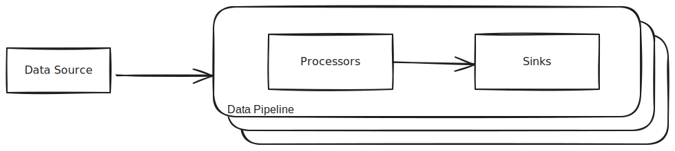

# Integration Connector Agent

The Integration Connector Agent connects to external sources and keeps changes
synchronized between the source and one or more sinks. It also enables for data
processing before sending it to the sinks.

## Key Features

- **Connect to External Sources**: Monitor and retrieve changes from various external data sources.
- **Update Sinks**: Propagate detected changes to one or more sinks to keep data up-to-date.
- **Data Processing**: Configure processors to transform or process data before sending it to the sinks.

## Key Benefits

The Integration Connector Agent provides the flexibility to retrieve data from any source and deliver it to any sink.
This data can then be utilized for various purposes, including:

- **Data Accessibility**: Aggregate data from multiple sources by configuring the agent, simplifying data retrieval.
- **Analytics**: Centralized data storage enables advanced analytics and the creation of comprehensive scorecards.
- **External Integration**: Simplify the development of custom applications by building efficient data pipelines with the agent.

When used alongside Mia-Platform Console, the agent enhances the Console's extensibility features,
enabling users to integrate additional information into their Internal Developer Platform.
Examples include:

- Comprehensive scorecards
- Software catalog metadata augmentation
- Custom data visualizations

## Supported Sinks and Sources

Currently, the supported **Sources** are:

- [Mia-Platform Console](./sources/15_console.md)
- [Jira](./sources/20_jira.md)
- [GitHub](./sources/20_github.md)
- [Confluence](./sources/25_confluence.md)
- [GitLab](./sources/25_gitlab.md)
- [JBoss](./sources/25_jboss.md)
- [GCP Asset Inventory from Pub/Sub](./sources/30_gcp_pubsub_asset_inventory.md)
- [Azure Activity Log from EventHub](./sources/40_azure_activity_log_event_hub.md)
- [Azure DevOps](./sources/45_azure_devops.md)
- [AWS CloudTrail from SQS](./sources/50_aws_cloudtrail_sqs.md)

The supported **Sinks** are:

- [Mia-Platform Console Catalog](./sinks/15_console-catalog.md)
- [MongoDB](./sinks/20_mongodb.md)
- [Mia-Platform CRUD Service](./sinks/30_crudservice.md)
- [Kafka](./sinks/40_kafka.md)

The supported **Processors** are:

- [Filter](./processors/15_filter.md)
- [Mapper](./processors/20_mapper.md)
- [RPC Plugin](./processors/30_rpc_plugin.md)
- [Cloud Vendor Aggregator](./processors/40_cloud_vendor_aggregator.md)

More sources and sinks are planned for future releases.

## Architecture

As an integration developer, this tool is ideal for synchronizing data between different platforms or systems, ensuring
real-time updates across all configured sinks.

The following image illustrates the architecture of the Integration Connector Agent.


### Data Processing

For each source, you can configure different pipelines. Each pipeline can have one or more
processors and must have at least one sink.



### Use Cases

Below are some use cases with their related configuration files.

#### Integration with Jira as Source and MongoDB as Sink

The following configuration demonstrates how to integrate Jira with a MongoDB sink, using mapper processing.

Pipeline workflow:

1. The Jira source is configured with an authentication secret taken from the environment variable `JIRA_SECRET`
1. The input Jira issue event is mapped to the output event:
   - `key` maps to the issue.key field of the Jira event
   - `summary` maps to the issue.fields.summary field of the Jira event
   - `createdAt` maps to the issue.fields.created field of the Jira event
   - `description` maps to the issue.fields.description field of the Jira event
1. The MongoDB sink is configured with the URL taken from the environment variable `MONGO_URL`
   to save data into the collection `jira-issues`

<details>
<summary>Jira + MongoDB Sink Configuration</summary>

```json
{
  "integrations": [
    {
      "source": {
        "type": "jira",
        "authentication": {
          "secret": {
            "fromEnv": "JIRA_SECRET"
          }
        }
      },
      "pipelines": [
        {
          "processors": [
            {
              "type": "mapper",
              "outputEvent": {
                "key": "{{ issue.key }}",
                "summary": "{{ issue.fields.summary }}",
                "createdAt": "{{ issue.fields.created }}",
                "description": "{{ issue.fields.description }}"
              }
            }
          ],
          "sinks": [
            {
              "type": "mongo",
              "url": {
                "fromEnv": "MONGO_URL"
              },
              "collection": "jira-issues"
            }
          ]
        }
      ]
    }
  ]
}
```

</details>

## Installation and Setup

For detailed installation instructions, see:

- [Installation Guide](./20_install.md)

## Documentation Index

### Getting Started

- [Overview](./10_overview.md) - This document
- [Installation Guide](./20_install.md) - How to install and set up the Integration Connector Agent
- [Architecture](./30_architecture.md) - System architecture and data flow diagrams

### Sources Documentation

For detailed information about configuring each source:

- [Sources Overview](./sources/10_overview.md)
- [Mia-Platform Console](./sources/15_console.md)
- [GitHub](./sources/20_github.md)
- [Jira](./sources/20_jira.md)
- [Confluence](./sources/25_confluence.md)
- [GitLab](./sources/25_gitlab.md)
- [JBoss](./sources/25_jboss.md)
- [GCP Pub/Sub Asset Inventory](./sources/30_gcp_pubsub_asset_inventory.md)
- [Azure Activity Log from EventHub](./sources/40_azure_activity_log_event_hub.md)
- [Azure DevOps](./sources/45_azure_devops.md)
- [AWS CloudTrail from SQS](./sources/50_aws_cloudtrail_sqs.md)

### Sinks Documentation

For detailed information about configuring each sink:

- [Sinks Overview](./sinks/10_overview.md)
- [Mia-Platform Console Catalog](./sinks/15_console-catalog.md)
- [MongoDB](./sinks/20_mongodb.md)
- [Mia-Platform CRUD Service](./sinks/30_crudservice.md)
- [Kafka](./sinks/40_kafka.md)

### Processors Documentation

For detailed information about configuring each processor:

- [Processors Overview](./processors/10_overview.md)
- [Filter Processor](./processors/15_filter.md)
- [Mapper Processor](./processors/20_mapper.md)
- [RPC Plugin Processor](./processors/30_rpc_plugin.md)
- [Cloud Vendor Aggregator Processor](./processors/40_cloud_vendor_aggregator.md)

### Use Cases and Examples

- [Infrastructure Import Use Cases](./use-cases/)
  - [GCP Infrastructure Import](./use-cases/infrastructure-import/10_GCP_infrastructure_import.md)
  - [AWS Infrastructure Import](./use-cases/infrastructure-import/20_AWS_infrastructure_import.md)
  - [Azure Infrastructure Import](./use-cases/infrastructure-import/30_azure_infrastructure_import.md)

### Configuration Examples

The `examples/` directory contains ready-to-use configuration files for various integrations:

#### Source-Specific Examples

- [Azure Pipeline Configurations](../examples/azure-pipeline-configurations.md) - Complete guide with three configurations
- [Azure Complete Pipeline](../examples/azure-complete-pipeline-config.json) - Full Azure fields mapping
- [Azure Simple Pipeline](../examples/azure-simple-pipeline-config.json) - Essential Azure fields only
- [Azure Conditional Pipeline](../examples/azure-conditional-pipeline-config.json) - Balanced configuration
- [Confluence Integration](../examples/confluence-config.json) - Confluence source configuration
- [GitHub App Integration](../examples/github-app-config.json) - GitHub App authentication
- [GitHub Token Integration](../examples/github-token-config.json) - GitHub Personal Access Token authentication
- [GitLab CI Monitoring](../examples/gitlab-ci-monitoring-config.json) - GitLab CI/CD pipeline monitoring
- [GitLab Token Integration](../examples/gitlab-token-config.json) - GitLab Personal Access Token authentication
- [GitLab Webhook Integration](../examples/gitlab-webhook-config.json) - GitLab webhook configuration

#### Processor Examples

- [RPC Processor Plugin](../examples/rpc-processor-plugin/) - Custom RPC processor implementation example

### Mia-Platform Catalog Type Definitions

The `mia-platform-item-types/` directory contains JSON schema definitions for different entity types that can be stored
in the Mia-Platform Console Catalog. These schemas define the structure and validation rules for each type of entity.

#### Available Item Types

**Azure Resources:**

- [Azure Resource Schema](../mia-platform-item-types/azure/azure-resource.json) - Generic schema for all Azure resource types
- Supports: Virtual Machines, Kubernetes Clusters, Virtual Networks, Storage Accounts, Databases, and more
- [Azure Documentation](../mia-platform-item-types/azure/README.md) - Detailed guide and examples

**GitHub Entities:**

- [GitHub Repository](../mia-platform-item-types/github/github-repository.json) - Repository metadata and settings
- [GitHub Issues](../mia-platform-item-types/github/github-issue.json) - Issue tracking and management
- [GitHub Pull Requests](../mia-platform-item-types/github/github-pull-request.json) - Code review and merge requests
- [GitHub Releases](../mia-platform-item-types/github/github-release.json) - Software releases and tags
- [GitHub Workflow Runs](../mia-platform-item-types/github/github-workflow-run.json) - CI/CD pipeline executions
- [GitHub Members](../mia-platform-item-types/github/github-member.json) - Repository collaborators
- [GitHub Stars](../mia-platform-item-types/github/github-star.json) - Repository stars and watches
- [GitHub Documentation](../mia-platform-item-types/github/README.md) - Complete schema reference

**GitLab Entities:**

- [GitLab Projects](../mia-platform-item-types/gitlab/gitlab-project.json) - Project repositories and settings
- [GitLab Merge Requests](../mia-platform-item-types/gitlab/gitlab-merge-request.json) - Code review workflows
- [GitLab Pipelines](../mia-platform-item-types/gitlab/gitlab-pipeline.json) - CI/CD pipeline executions
- [GitLab Releases](../mia-platform-item-types/gitlab/gitlab-release.json) - Software releases
- [GitLab Documentation](../mia-platform-item-types/gitlab/README.md) - Schema definitions and usage

**Confluence Entities:**

- [Confluence Pages](../mia-platform-item-types/confluence/confluence-page.json) - Wiki pages and documentation
- [Confluence Spaces](../mia-platform-item-types/confluence/confluence-space.json) - Documentation spaces
- [Confluence Documentation](../mia-platform-item-types/confluence/README.md) - Schema reference

#### How to Add Type Definitions to Mia-Platform Catalog

To add new entity types to your Mia-Platform Console Catalog, follow these steps:

- **Choose or Create a Schema**: Select an existing schema from `mia-platform-item-types/` or create a new one
  based on your data structure.

- **Configure Your Pipeline**: Use the schema as a reference when configuring your mapper processor to ensure
  data compatibility:

  ```json
  {
    "type": "mapper",
    "outputEvent": {
      "name": "{{ repository.name }}",
      "runtimeData": {
        "name": "{{ repository.name }}",
        "type": "github-repository",
        "provider": "github",
        "organizationLogin": "{{ repository.owner.login }}",
        "visibility": "{{ repository.visibility }}",
        "defaultBranch": "{{ repository.default_branch }}",
        "language": "{{ repository.language }}",
        "topics": "{{ repository.topics }}",
        "timestamp": "{{ timestamp }}"
      }
    }
  }
  ```

- **Configure the Console Catalog Sink**: Set up the sink to store entities in the Console Catalog:

  ```json
  {
    "type": "console-catalog",
    "baseUrl": {
      "fromEnv": "CONSOLE_BASE_URL"
    },
    "authentication": {
      "serviceAccount": {
        "clientSecret": {
          "fromEnv": "CONSOLE_SERVICE_ACCOUNT_CLIENT_SECRET"
        }
      }
    },
    "itemType": "github-repository"
  }
  ```

- **Import the Schema**: In your Mia-Platform Console, navigate to the Catalog section and import the JSON schema
  to define the new item type structure.

- **Validate Data**: The Console will validate incoming data against the schema, ensuring data consistency and
  enabling rich catalog features like search, filtering, and relationships.

#### Schema Benefits

Using these predefined schemas provides several advantages:

- **Data Validation**: Ensures consistent data structure across all entities
- **Rich Metadata**: Includes labels, annotations, and links for better organization
- **Search and Filtering**: Enables powerful catalog search capabilities
- **Relationships**: Supports entity relationships and dependencies
- **Integration**: Seamless integration with Mia-Platform Console features

### Troubleshooting

- [Azure Permissions](./troubleshooting/azure_permissions.md)

### Migration Guides

- [GitHub Authentication Migration](./GITHUB_AUTHENTICATION_MIGRATION.md)

