# Architecture

The Integration Connector Agent follows a modular, pipeline-based architecture that enables flexible data flow from various
sources through configurable processors to multiple destinations. This document provides a comprehensive overview of the
system architecture and data flow patterns.

## 🏗️ High-Level Architecture

The Integration Connector Agent consists of three main components that work together to form data integration pipelines:

### Core Components

- **Sources**: External systems that generate or provide data
- **Processors**: Data transformation and filtering components  
- **Sinks**: Destination systems where processed data is stored or forwarded

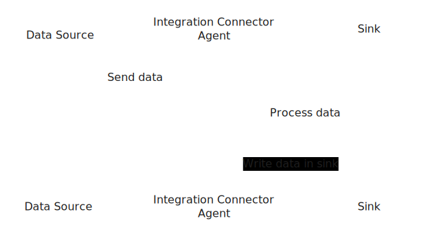

### Agent Components

- **Configuration Manager**: Loads and validates pipeline configurations
- **Source Manager**: Manages connections to external data sources
- **Pipeline Orchestrator**: Coordinates data flow through processor chains
- **Sink Manager**: Handles data delivery to destination systems
- **Event Bus**: Internal messaging system for component communication
- **Health Monitor**: Monitors component health and pipeline status

## 🔄 Data Flow Pipeline

The following diagram illustrates the complete data flow from source to sink:

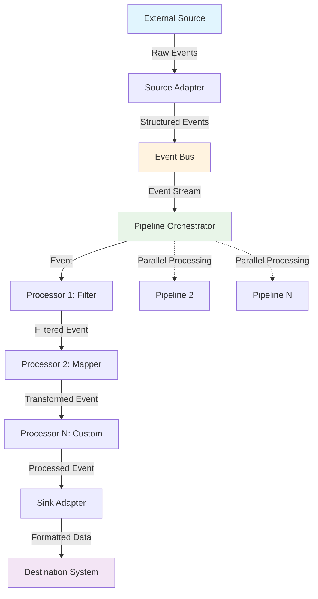

### Detailed Flow Steps

- **Data Ingestion**
  - Source adapters connect to external systems
  - Raw data is normalized into internal event format
  - Events are published to the internal event bus

- **Pipeline Processing**
  - Pipeline Orchestrator receives events from the event bus
  - Each pipeline processes events through its configured processor chain
  - Processors can filter, transform, enrich, or validate data

- **Data Output**
  - Processed events are sent to configured sinks
  - Sink adapters format data according to destination requirements
  - Data is delivered to target systems with retry and error handling

## 📊 Component Architecture

### Source Components

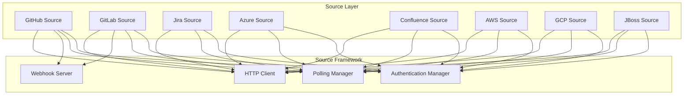

### Processor Components

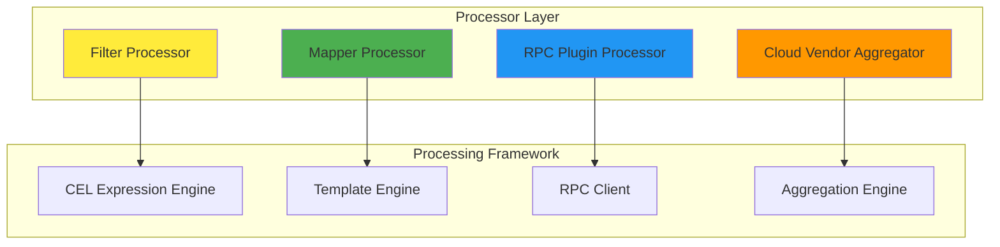

### Sink Components

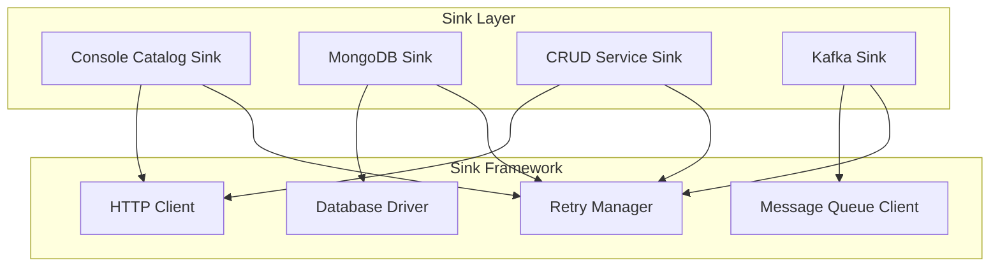

## 🔧 Configuration Architecture

The agent uses a hierarchical configuration structure that defines integrations, pipelines, and components:

```yaml
Configuration:
  ├── Integrations[]
  │   ├── Source
  │   │   ├── Type (github, gitlab, jira, etc.)
  │   │   ├── Connection Settings
  │   │   └── Authentication
  │   └── Pipelines[]
  │       ├── Processors[]
  │       │   ├── Type (filter, mapper, rpc, etc.)
  │       │   └── Configuration
  │       └── Sinks[]
  │           ├── Type (console-catalog, mongo, etc.)
  │           └── Connection Settings
```

### Configuration Flow

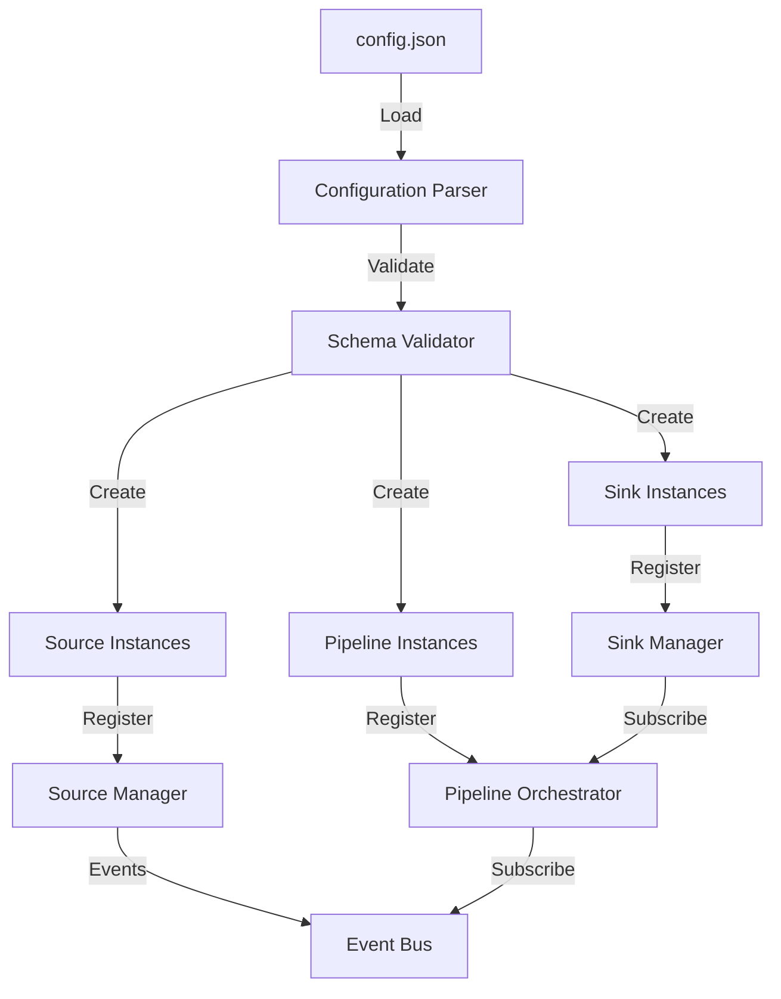

## 🚀 Deployment Architecture

### Standalone Deployment

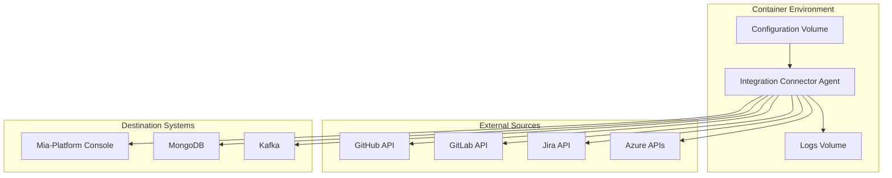

### Kubernetes Deployment

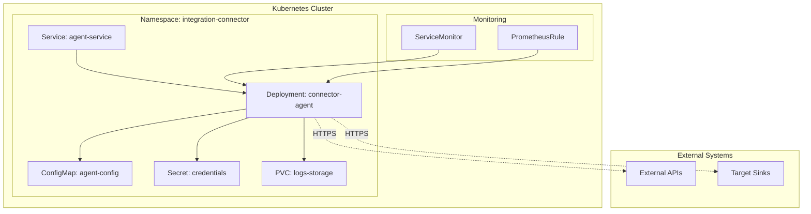

## 🔄 Event Processing Model

### Event Lifecycle

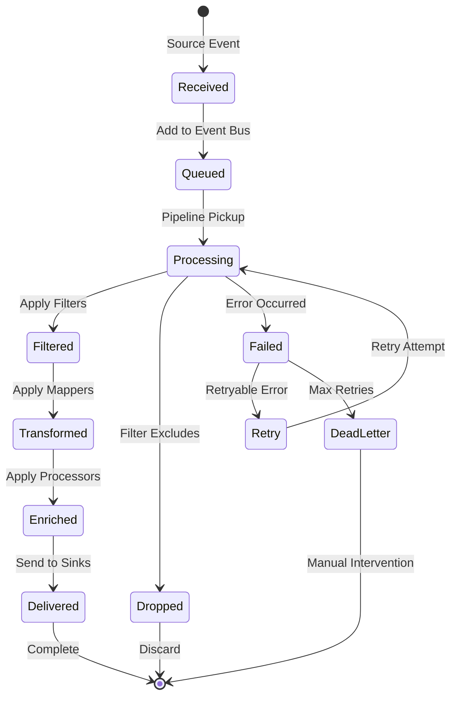

### Parallel Processing

The agent supports parallel processing across multiple dimensions:

- **Source Parallelism**: Multiple source instances can run concurrently
- **Pipeline Parallelism**: Each source can have multiple independent pipelines
- **Processor Parallelism**: Processors within a pipeline can be chained or parallel
- **Sink Parallelism**: Each pipeline can send data to multiple sinks simultaneously

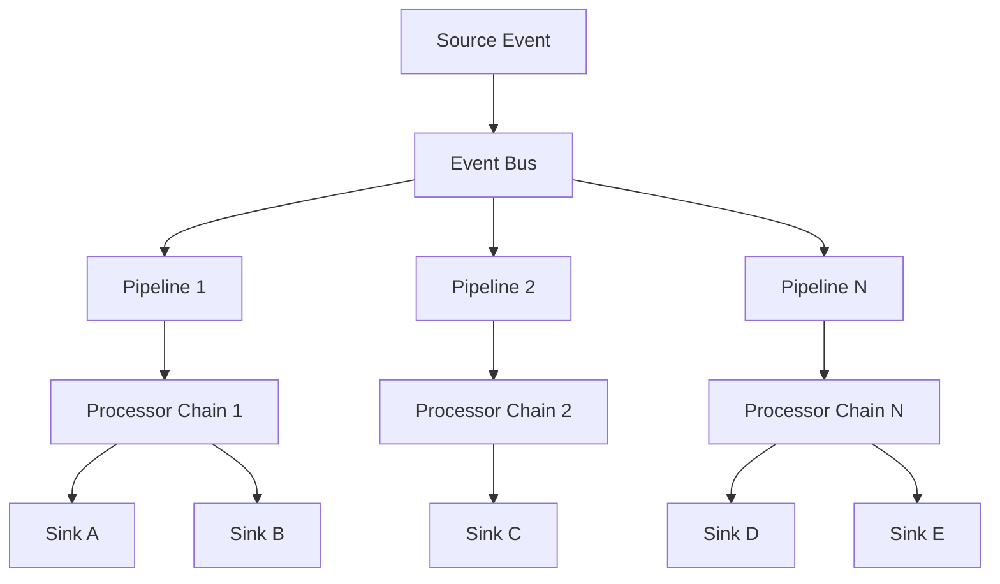

## 📈 Scalability and Performance

### Horizontal Scaling

- **Multi-Instance Deployment**: Deploy multiple agent instances for increased throughput
- **Source Partitioning**: Distribute sources across different agent instances
- **Load Balancing**: Use external load balancers for webhook endpoints

### Vertical Scaling

- **Memory Optimization**: Configurable buffer sizes and batch processing
- **CPU Optimization**: Parallel processor execution and async I/O
- **Network Optimization**: Connection pooling and keep-alive connections

### Performance Monitoring

The agent exposes metrics for monitoring and optimization:

- **Source Metrics**: Event ingestion rates, connection health
- **Pipeline Metrics**: Processing latency, throughput, error rates
- **Sink Metrics**: Delivery success rates, retry attempts, latency

## 🔒 Security Architecture

### Authentication & Authorization

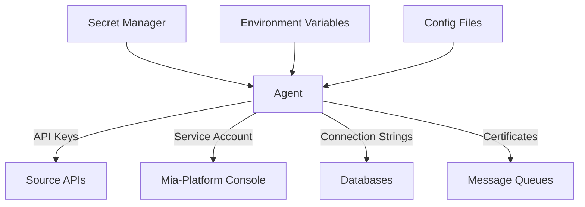

### Security Layers

- **Transport Security**: TLS encryption for all external communications
- **Authentication**: Multiple authentication methods (API keys, OAuth, service accounts)
- **Secret Management**: Secure storage and rotation of credentials
- **Network Security**: VPC/firewall rules for network isolation
- **Runtime Security**: Container security and resource limits

## 🛠️ Extensibility

The agent is designed for extensibility through well-defined interfaces:

### Plugin Architecture

- **Source Plugins**: Implement new data sources
- **Processor Plugins**: Add custom data transformation logic
- **Sink Plugins**: Support new destination systems

### Custom Components

- **RPC Processors**: External processing services via gRPC
- **Custom Authentication**: Pluggable authentication providers
- **Custom Formats**: Support for additional data formats and protocols

This architecture ensures the Integration Connector Agent can adapt to new requirements and integrate with evolving
technology stacks while maintaining reliability and performance.
